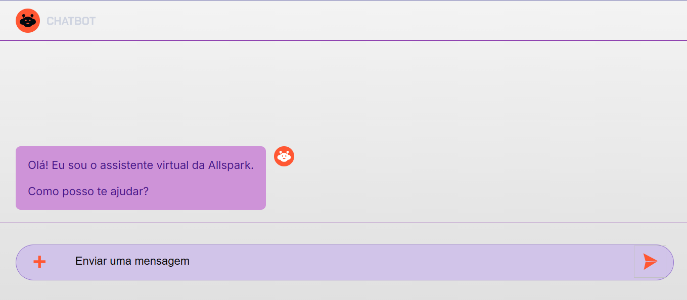

# Chatbot Allspark E-commerce

**Desenvolvido por:** Kleryton de Souza


## Visão Geral

O projeto "Chatbot Allspark E-commerce" visa desenvolver um chatbot inteligente para auxiliar clientes em um e-commerce de eletrônicos. Utilizando a API da OpenAI e a biblioteca `langchain`, o chatbot é capaz de fornecer respostas precisas e relevantes, melhorando a experiência do usuário e otimizando o atendimento ao cliente. A integração de IA Generativa e Modelos de Linguagem de Grande Escala (LLM) permite que o chatbot compreenda e responda a uma ampla variedade de consultas de forma natural e eficiente.

## Visão de Negócio

A implementação de um chatbot no e-commerce de eletrônicos visa:

- Melhorar a experiência do cliente com respostas rápidas e precisas.
- Reduzir a carga de trabalho do atendimento ao cliente.
- Aumentar a satisfação do cliente e, consequentemente, as vendas.

## Valor Gerado

O chatbot ajuda a transformar a interação com o cliente em uma experiência mais eficiente e agradável, permitindo que a empresa:

- **Responda a perguntas frequentes de forma automática:** O chatbot pode lidar com consultas comuns, liberando os atendentes humanos para lidar com questões mais complexas.
- **Ofereça suporte 24/7:** Com o chatbot, os clientes podem obter ajuda a qualquer hora do dia, melhorando a acessibilidade e a conveniência.
- **Direcione os clientes para os produtos certos com base em suas necessidades:** O chatbot pode recomendar produtos com base nas preferências e necessidades dos clientes, aumentando as chances de conversão.
- **Aumente a eficiência operacional:** Ao automatizar o atendimento ao cliente, a empresa pode reduzir custos operacionais e melhorar a eficiência.
- **Melhore a satisfação do cliente:** Respostas rápidas e precisas aumentam a satisfação do cliente, o que pode levar a um aumento na fidelidade e nas vendas.

## Sumário

- [Descrição do Projeto](#descrição-do-projeto)
- [Pré-requisitos](#pré-requisitos)
- [Instalação](#instalação)
- [Configuração](#configuração)
- [Estrutura do Projeto](#estrutura-do-projeto)
- [Execução](#execução)
- [Testes](#testes)
- [Exemplo de Interação](#exemplo-de-interação)
- [Referências](#referências)
- [Licença](#licença)

## Descrição do Projeto

O chatbot é desenvolvido utilizando a API da OpenAI para processamento de linguagem natural. Ele é capaz de responder a perguntas frequentes, fornecer informações sobre produtos e ajudar os clientes a navegar pelo site de e-commerce.

### Importância da IA Generativa e LLM

A IA Generativa e os Modelos de Linguagem de Grande Escala (LLM) desempenham um papel crucial neste projeto. Eles permitem que o chatbot compreenda e gere respostas em linguagem natural, proporcionando uma interação mais humana e eficiente com os clientes. A utilização de LLMs, como os oferecidos pela OpenAI, garante que o chatbot possa lidar com uma ampla variedade de consultas e fornecer respostas precisas e contextualmente relevantes.

## Pré-requisitos

Certifique-se de ter as seguintes ferramentas instaladas:

- [Python 3.8+](https://www.python.org/)
- [pip](https://pip.pypa.io/en/stable/installing/)
- Um ambiente virtual separado para gerenciar as dependências do projeto.

### Bibliotecas Necessárias

- `numpy`
- `openai`
- `python-dotenv`
- `tiktoken`
- `flask`
- `opencv-python`
- `langchain`

## Instalação

1. Clone o repositório:

   ```bash
   git clone https://github.com/klerytondev/Chatbot-Electronics-E-commerce.git
   cd chatbot-allspark-e-commerce
   ```

2. Crie um ambiente virtual separado para o projeto e ative-o:

   **Windows:**
   ```bash
   python -m venv chatbot-allspark-e-commerce
   chatbot-allspark-e-commerce\Scripts\activate
   ```

   **Mac/Linux:**
   ```bash
   python3 -m venv chatbot-allspark-e-commerce
   source chatbot-allspark-e-commerce/bin/activate
   ```

3. Instale as dependências:

   ```bash
   pip install -r requirements.txt
   ```

## Configuração

### Gerando uma Chave de API da OpenAI

1. Acesse o site da [OpenAI](https://www.openai.com/) e crie uma conta, se ainda não tiver uma.
2. Após fazer login, vá para a seção de [API Keys](https://platform.openai.com/account/api-keys).
3. Clique em "Create new secret key" para gerar uma nova chave de API.
4. Copie a chave gerada. Você precisará dela para configurar o projeto.

### Configurando o Arquivo `.env`

1. Crie um arquivo `.env` na raiz do projeto.
2. Adicione a chave de API da OpenAI ao arquivo `.env` no seguinte formato:

```env
OPENAI_API_KEY=your_openai_api_key
```

Substitua `your_openai_api_key` pela chave que você copiou anteriormente.

## Estrutura do Projeto

A estrutura do projeto é organizada da seguinte forma:

```
chatbot-allspark-e-commerce/
├── app.py
├── requirements.txt
├── .env.example
├── README.md
├── tests/
│   └── test_app.py
├── templates/
│   └── index.html
├── static/
│   ├── css/
│   │   └── styles.css
│   └── js/
│       └── scripts.js
└── utils/
    └── helpers.py
```

### Descrição das Pastas

- **app.py**: Arquivo principal que contém a lógica do chatbot e inicializa o servidor Flask.
- **requirements.txt**: Lista de dependências do projeto.
- **.env.example**: Exemplo de arquivo de configuração de ambiente.
- **README.md**: Documentação do projeto.
- **tests/**: Contém os testes unitários do projeto.
  - **test_app.py**: Testes para o arquivo `app.py`.
- **templates/**: Contém os templates HTML utilizados pelo Flask.
  - **index.html**: Template principal da aplicação.
- **static/**: Contém arquivos estáticos como CSS e JavaScript.
  - **css/**: Contém arquivos de estilo CSS.
    - **styles.css**: Arquivo de estilos da aplicação.
  - **js/**: Contém arquivos JavaScript.
    - **scripts.js**: Arquivo de scripts da aplicação.
- **utils/**: Contém funções auxiliares e utilitárias.
  - **helpers.py**: Funções auxiliares utilizadas no projeto.

## Execução

Para rodar o chatbot:

```bash
python app.py
```

O chatbot estará disponível em `http://127.0.0.1:5000/`.

## Testes

Para executar os testes unitários:

```bash
pytest
```

## Exemplo de Interação

O chatbot Allspark E-commerce é projetado para fornecer respostas rápidas e precisas às perguntas dos usuários. Abaixo está um exemplo de como a interação com o chatbot pode ocorrer:

<br>
  
<br><br>

**Usuário:** Olá, eu gostaria de saber mais sobre os produtos de armazenamento que vocês oferecem.

**Chatbot:** Olá! Claro, nós oferecemos uma variedade de produtos de armazenamento, incluindo:
- SSDs NVMe para velocidades ultrarrápidas.
- HDDs de grande capacidade para backup e arquivos massivos.
- Sistemas NAS (Network Attached Storage) para armazenamento em rede.

**Usuário:** Quais são os produtos disponíveis na categoria de Gaming?

**Chatbot:** Na categoria de Gaming, nós temos:
- Consoles de videogame de última geração.
- Volantes, controles e acessórios para jogos de simulação.
- Cadeiras gamers ergonômicas para maior conforto durante longas sessões.
- Mesas gamers com ajuste de altura e organização de cabos.
- Iluminação RGB para setups de jogos personalizados.

**Usuário:** Vocês têm produtos para casa inteligente?

**Chatbot:** Sim, temos vários produtos para casa inteligente, incluindo:
- Assistentes virtuais (Google Nest, Amazon Alexa).
- Lâmpadas inteligentes controladas por voz.
- Fechaduras eletrônicas com integração via smartphone.
- Câmeras de segurança com monitoramento remoto.
- Termostatos inteligentes para controle de temperatura.
- Sensores de movimento e automação residencial.

**Usuário:** Como posso aplicar um código de desconto?

**Chatbot:** Para aplicar um código de desconto, basta inserir o código promocional no campo apropriado durante o processo de checkout. Por exemplo, você pode usar o código TECH10 para obter 10% de desconto em notebooks selecionados até 30/11/2024.

**Usuário:** Qual é a política de devolução de vocês?

**Chatbot:** Nossa política de devolução permite que você devolva produtos não utilizados e em perfeitas condições dentro de 30 dias. Os custos de envio de devolução são de responsabilidade do cliente, a menos que o produto tenha chegado com defeito ou danificado. Os reembolsos podem ser emitidos na forma de crédito na loja ou reembolso no método de pagamento original.

**Usuário:** Como posso entrar em contato com o atendimento ao cliente?

**Chatbot:** Você pode entrar em contato com nossa equipe de atendimento ao cliente por chat ao vivo ou e-mail (allspark@empresa.com). Estamos disponíveis para ajudar com perguntas, preocupações e assistência nas compras.

## Referências

- [Preços OpenAI](https://openai.com/pricing)

## Licença

Este projeto está licenciado sob a MIT License. Sinta-se à vontade para usar, modificar e distribuir este software, desde que mantenha os créditos apropriados.